# Industrial RAG Implementation Overview

> [!NOTE]
> This document is designed to help you present the RAG system to technical team members and stakeholders. It identifies key design choices and the benefit of each component.

---

## 🏗️ Architecture Stack

| Component | Technology | *Why we chose it* |
| :--- | :--- | :--- |
| **LLM** | Ollama (Llama 3.2:3b) | High performance with low local compute requirements. |
| **Embeddings** | Nomic-Embed-Text | Industry standard for semantic retrieval accuracy. |
| **Vector DB** | Postgres + pgvector | Leveraging existing SQL infrastructure while adding vector search. |
| **Orchestration** | LangGraph | State-machine based control over RAG cycles (unlike basic linear chains). |
| **Cache** | Redis | sub-millisecond response times for recurring user queries. |
| **Backend** | FastAPI (Python) | High-concurrency async performance with automatic documentation. |

---

## 🔄 Workflow Diagram

```mermaid
graph TD
    subgraph "Phase 1: Knowledge Ingestion"
        A["📖 Source Docs (PDF, Excel, Docx)"] --> B["⚙️ Unified Loader Factory"]
        B --> C["✂️ Recursive Splitting (1000ch chunks)"]
        C --> D["🧠 Semantic Embedding"]
        D --> E[("📦 pgvector Storage")]
    end

    subgraph "Phase 2: Intelligent Retrieval"
        F["👤 User Query"] --> G{"⚡ Redis Cache check"}
        G -- Hit --> H["✅ Instant Response"]
        G -- Miss --> I["🔍 Vector Search"]
        I --> J["📄 Context Retrieval"]
    end

    subgraph "Phase 3: Generation"
        J --> K["🕸️ LangGraph Orchestrator"]
        K -- "Prompt + Context" --> L["🤖 Llama 3.2 LLM"]
        L --> M["💬 Verified Answer + Citations"]
    end

    E -.-> I
```

---

## 🌟 Key Value Propositions (For the Team)

1.  **100% Privacy & Security**: Unlike OpenAI-based systems, all data processing occurs **locally** via Ollama and local Postgres. No document leaves the internal network.
2.  **Tabular Awareness**: Our custom `PandasLoader` doesn't just read Excel rows; it "explains" them to the AI by injecting headers into every chunk, fixing a common failure point in standard RAG systems.
3.  **Traceability (Citations)**: The system doesn't just answer; it cites the source. Every claim includes a link back to the specific manual or spreadsheet used.
4.  **Resilience**: The system handles large uploads via background workers and batches vector additions (50 at a time) to prevent server crashes.

---

## ⚙️ Technical Deep Dive

### 1. Ingestion Strategy
- **Recursive Splitting**: We use a `chunk_overlap` of 200 to ensure that sentences cut off at the end of a chunk are captured in the next one, preserving semantic context.
- **Header Prepending**: Every chunk is prefixed with `--- Document: filename ---`. This ensures the AI always "knows" what file it is looking at, even for small fragments.

### 2. State Management with LangGraph
Instead of a simple "Query -> Search -> Answer" flow, we use LangGraph to:
- Maintain conversation memory.
- Route queries based on intent.
- Prepare the system for future "agentic" capabilities (like searching the web or executing code).

### 3. Maintenance & Ops
- **`/verify` Endpoint**: A dedicated health check that tests the core "Retrieval Path" with a real query to ensure the vector store is responding.
- **One-Command Setup**: Infrastructure and API are containerized/scripted for easy deployment to other team machines.

---

## ❓ Common Questions for Team Presentation

- **"How large a file can it handle?"** 
  - *Answer*: Thanks to batching and background tasks, it can handle multi-megabyte Excel and PDF files without blocking the UI.
- **"What about hallucinations?"** 
  - *Answer*: We use a low `temperature` in the LLM and strictly limit the context to retrieved documents, significantly reducing the chance of made-up info.
- **"Is it easy to add new document types?"** 
  - *Answer*: Yes, the `get_loader` factory is modular; we can add support for JSON, XML, or SQL databases by adding a single class.
